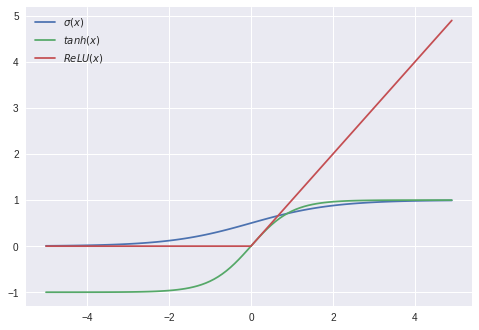

# Introduction

Deep Learning. Neural Networks. Maybe you've seen these terms thrown around in the news, or on job postings, or in hushed whispers in the back of your Intro to CS course. You've seen that neural networks have been able to beat humans at complex tasks (like the game [Go](https://deepmind.com/research/alphago/), or more recently [even Starcraft](https://deepmind.com/blog/alphastar-mastering-real-time-strategy-game-starcraft-ii/)). However, when you try to start using deep learning on your own, a quick google finds packages like `TensorFlow`, `PyTorch` and `Keras`, documentation full of opaque jargon, and no clear starting point. 

The goal of this track is to help with that - this track is designed to give you a solid foundation in the fundamental concepts of deep learning, so that you are prepared to dive into the depths of the subject in an informed and measured way. Rather than teaching you to use neural networks as a black box, this track aims to bring transparency to deep learning so that you can work with confidence.

## What will this track cover?

The theory of deep learning. This track will explain both the math and (perhaps more importantly) the intuition of what a neural network is and how it functions. After completing this track, you will understand the basic structure of a neural network, and how that basic structure can be manipulated and multiplied in size to "learn".

A basic implementation of a neural network. As you move throughout the track, you will build a basic neural network up from scratch. 

## What won't this track cover?

The specifics of any particular applied deep learning package. There are many flavors of deep learning out there, and different ones are suited for different tasks. Not only are the majority of those packages well documented with tutorials and guides, but they are also all best approached with an understanding of what neural networks are actually doing.  

## Prerequisites

You'll get the most out of this track if you have rudimentary knowledge of linear algebra, calculus, and Python. In particular:
- how to compute a [dot product](https://betterexplained.com/articles/vector-calculus-understanding-the-dot-product/), or multiply two matrices
- the [chain rule](https://betterexplained.com/articles/derivatives-product-power-chain/), when taking the derivative of a composite function
- implementing `if` statements, `list`s, and loops in Python

We'll provide plenty of refreshers on each of these concepts along the way. As always, __DevFest__ TAs will be walking around to clarify anything - we're all here to learn.

# Linear models

Machine learning is about learning patterns from data. _Deep learning_ is a subset of machine learning, where we'll build neural networks to identify patterns. We'll first need a strong understanding of _linear models_. Linear models are the basis of individual _artificial neurons_, which we'll layer together to build _artificial neural networks_ soon enough.

> ### What's a linear model?
> A _linear model_ is simply an equation where each term is either:
  - a constant, or
  - a product of a parameter and a variable

> For example, $ax + b = 0$ and $ax^2 + bx + c = 0$ are both linear models where $x$ is a variable  and $a, b, c$ are constant terms. 

> Despite the $x^2$ term, $ax^2+bx+c = 0$ is a linear model because the model is linear in the _parameter_ $x^2$: we multiply it by some constant $a$. If this is confusing, imagine setting $u = x^2$ and substituting it into the model: then our model is $au + bx +c = 0$, which is easier to identify as linear.

We'll find out soon that the core of all neural networks is a set of nonlinear functions. This nonlinearity makes neural networks - as you might have heard - very powerful. Soon we'll build those nonlinear functions ourselves.

First, we need to build a few linear functions. Then we can transform them into a powerful nonlinear form. 

## Perceptrons
A __perceptron__ is a simple, single-unit artificial neuron. A perceptron takes several inputs and returns a binary output: either a $0$ or $1$, representing which class an input belongs to. For example, a perceptron could take the data point in $3$ dimensions $x = \begin{bmatrix}x_1\\x_2\\x_3\end{bmatrix}$:

>> 

The __perceptron__ is a learning algorithm. It finds a separating _hyperplane_ by minimizing the distance of misclassified points to the _decision boundary_. 

### Lines in higher dimensions
Most students will be familiar with the equation of a line. For example, $y = -2x$ is an equation for a line. Rewriting this equation lets us generalize the line equation to higher dimensions. First, convert into the normal form, $2x + y = 0$. Then, we can represent the normal form as the dot product $[ 2,1 ]\cdot [ x,y ] = 0$.
Finally, we can represent all lines passing through any point by adding a _bias_ weight. The _bias_ is a constant; for example, the line equations

$$
\big( [ 2,1 ]\cdot [ x,y ] \big) -1 = 0 \\
2x + y = 1 \\
y = -2x + 1
$$

are equivalent. Finally, we can generalize this linear model to the form most popular in machine learning:

$$
w^Tx + b = 0
$$

which expands to the equation of a _hyperplane_: $w_1x_1 + w_2x_2 + \dots + w_nx_n + b = 0$. That looks uncoincidentally like our original line equation, but now in $n$ dimensions: in fact, a point is a _hyperplane_ in $1$-dimensional space, a line is a _hyperplane_ in $2$-dimensional space, and a plane is a _hyperplane_ in $3$-dimensional space.


### The hyperplane
_Hyperplane_: A subspace that separates a vector space into two parts. A linear equation for a _hyperplane_ lets us perform classification (for two classes) easily: an input point is either above or below the _hyperplane_. Each input has a _label_ of $0$ or $1$, signifying which of two classes it belongs to.

Formally, a [_hyperplane_](http://mathworld.wolfram.com/Hyperplane.html) is a subspace of dimension $n-1$ inside an $n$-dimensional space.

 >> 
 >> __Left:__ a line is a hyperplane in $2$-D space. __Right__: a plane is a hyperplane in $3$-D space.

### Classification using hyperplanes

A _decision function_ performs classification: given a point, it classifies that point as belonging to a certain set. 

Let's define a function $f:\mathbb{R}^n\rightarrow \mathbb{R}$. If you're not familiar with this notation, it just means that $f$ takes an $n$-dimensional input, and outputs a real number. We'll define $f$ using our hyperplane equation.

$$
\begin{align*}
w^T x &= \textrm{dot product of weight vector }w\textrm{ and input vector } x\\
b &= \textrm{ bias term} \\
f(x) &=w^T x + b
\end{align*}
$$


Then two points --- let's call them $x_1, x_2$ ---  located on opposite sides of that hyperplane will together satisfy one of the following inequalities:

$$
f(x_1) < 0 < f(x_2) \\
f(x_2) < 0 < f(x_1)
$$

So our _decision function_ could be as concise as $sign\big(f(x)\big)$, since that function outputs whether $f(x) > 0$ or $f(x) < 0$.

>> #### Exercise
>> Try this exercise for yourself: consider the toy dataset with just two inputs $u$, $v$:

$$
u = (0, 2) \quad y(u) = 1 \\
v = (1, 0) \quad y(v) = 0 \\
$$

>> where $y(u)$ is the label for point $u$. First, define a $w$ and $b$ for a hyperplane that correctly classifies inputs $u$ and $v$:

>> We want to find $w, b$ that satisfy the following for input $u$:

$$
\begin{align*}
w^T u + b > 0 \\
w_1u_1 + w_2u_2 + b > 0 \\
2w_2 + b > 0
\end{align*}
$$
>> and for $v$:
$$
\begin{align*}
w^T v + b < 0 \\
w_1v_1 + w_2v_2 + b < 0 \\
w_1 + b < 0
\end{align*}
$$

>> One such $w$ and $b$ is:

$$
\begin{align*}
w &= \begin{bmatrix}0\\1\end{bmatrix} \\
b &= -1
\end{align*}
$$

>> Then compute $f(x)$ and $sign\big(f(x)\big)$ for each point:

| &nbsp;&nbsp;&nbsp;&nbsp;&nbsp;point&nbsp;&nbsp;&nbsp;&nbsp;&nbsp;&nbsp;&nbsp;&nbsp; | label | $w^T x$ | $w^T x + b$ | $sign\big(f(x)\big)$ |
|----------|---------|--------|-------|-------|----------------------------------------|
| $u=(0,2)$ | $1$ | $2$ | $1$ | $+$ |
| $v=(1,0)$ | $0$ | $0$ | $-1$ | $-$ |

>> and you've found a hyperplane that correctly classifies $u$ and $v$. Thankfully, the Perceptron algorithm is designed specifically to find $w$ and $b$ for us.

### Training

All machine learning models need to be trained (fitted) to adjust their parameters and learn from a dataset. The perceptron is no exception. A perceptron finds its separating hyperplane $f(x) = w^T x + b$ by repeating two steps:
1. Check if the separating hyperplane misclassified (made a mistake on) any point.
2. If so, _update_ the coefficient vector ($w$) and bias ($b$) to remove that mistake.

The algorithm stops once all points are correctly classified. We can _update_ $w$ and $b$ to fix a mistaken classification using the following rule:

### Perceptron update rule
Let $x= $ an input point (e.g. a column vector), and $y \in \{0, 1\}= $ the ground truth label for that point. $f(x)$ satisfies one of three conditions:
1. If $f(x) = y$, then $f(x)$ made no mistake; no change.
2. If $f(x) = 1$ but $y=0$, then $w \leftarrow w-x$.
3. If $f(x) = 0$ but $y=1$, then $w \leftarrow w+x$.

We can condense this update rule further by observing that the expression $\big(y-f(x)\big)\in \{ -1, 1\}$ whenever $f(x)$ has made a mistake. Condensing (2.) and (3.):

1. If $f(x) = y$, no change
2. Else $w \leftarrow w + \big(y-f(x)\big)\cdot x$

This update rule pushes the hyperplane closer to any point misclassified by the perceptron. Perceptron convergence is guaranteed for any _linearly separable_ dataset.

### Simplifying out $b$
You'll notice we omitted any mention of the bias term $b$ in the update rule. For simplicity, linear models often append the bias term to the weight vector $w$. Appending $1$ to an input point $x$ lets us effectively compute the bias term using our dot product:

\begin{align*}
w := \begin{bmatrix}w_0\\w_1\\ \vdots \\ w_n \end{bmatrix} \quad x := \begin{bmatrix} x_0\\x_1\\ \vdots \\ x_n\end{bmatrix} & \quad \quad \quad
w' := \begin{bmatrix}w_0\\w_1\\ \vdots \\ w_n \\ b \end{bmatrix} \quad x' := \begin{bmatrix} x_0\\x_1\\ \vdots \\ x_n \\ 1\end{bmatrix} \\ \\
\langle w', x' \rangle &= w_0 x_0 + w_1 x_1 + \dots + w_n x_n + b(1) \\
&= \langle w, x \rangle + b
\end{align*}


### Hyperparameters
Neural networks by definition 'learn' parameters (weights) from training data. We can configure how a neural network learns by setting _hyperparameters_, which are continuous/integer-valued values manually set prior to training a model. The perceptron learning rate term $\eta$ is a hyperparameter set by you prior to the learning process.

### Psuedocode

```
X, y = training_data, training_labels
w = [0, 0, ..., 0]
b = 0
while(any points misclassified):
    for each (x, y) in (X, Y):
         f = w^T * x
         w = w + (y-f)*x
```

This version of the perceptron algorithm is considered the _Rosenblatt perceptron_. Other variations of the perceptron allow you to set a _hyperparameter_ $\eta$ (_eta_) which controls the rate of convergence of the separating hyperplane. Deep learning texts often refer to $\eta$ as the _learning rate_, since the $\eta$ term directly affects the rate at which an algorithm updates.

The learning rate $\eta$ does this by scaling the update rule: instead of setting $w \leftarrow w+\big(y - f(x)\big)\cdot x$, we set $w \leftarrow w + \eta\big(y-f(x)\big)\cdot x$. A larger $\eta$ (e.g. $\eta > 1 $) will tend to converge to a separating hyperplane faster, but also risks converging more slowly due to overshooting the decision boundary. A smaller $\eta$ (e.g. $\eta < 1$) will potentially find a more optimal separating hyperplane (i.e. one that maximizes distance to all points), but will also take longer to converge as we need to perform more updates.

We'll encounter this tradeoff between speed and cost again very soon, especially while learning about _gradient descent_.

### Implementation
Here's a quick `numpy` implementation.


```python
import matplotlib.pyplot as plt
import numpy as np
```


```python
X = np.array([
    [0.8, 0.4],
    [0.3, 0.1],
    [0.8, 0.8],
    [0.4, 0.6],
    [0.6, 0.8],
    [0.4, 0.2],
    [0.4, 0.5],
])
Y = np.array([0, 0, 1, 1, 1, 0, 1])
```


```python
def plot_points(X, Y, ax, c_pos='b', c_neg='r'):
    for i, x in enumerate(X):
        ax.scatter(x[0], x[1], s=120, 
                   marker=('_' if Y[i] <= 0 else '+'), linewidths=2, 
                   c=(c_neg if Y[i] <= 0 else c_pos))
```


```python
fig, ax = plt.subplots(figsize=(6, 6))
plot_points(X, Y, ax)
```


```python
def train(X, Y):
    w = np.zeros(X.shape[1]+1)
    epochs = 100
    for e in range(epochs):  
        for x, y in zip(X, Y):
            pred = np.where((np.dot(w[:2], x)+w[2]) >= 0.0, 1, 0)
            w[:2] += (y-pred) * x
            w[2] += (y-pred)
    return w

def predict(w, x):
    return np.where((np.dot(w[:2], x)+w[2]) > 0.0, 1, 0)
```


```python
w = train(X, Y)
```


```python
fig, ax = plt.subplots(figsize=(6, 6))
for a in range(0, 50):
    for b in range(0, 50):
        i, j = a/50, b/50
        p = predict(w, [i, j])
        ax.scatter(i, j, s=120, marker=('_' if p <= 0 else '+'), linewidths=2,
                   c=('r' if p <= 0 else 'b'), alpha=0.5
                   )
plot_points(X, Y, ax, c_pos='y', c_neg='y')
```


But linear models have limitations. In the 1980s the perceptron algorithm represented the state-of-the-art in deep learning, but it can't learn the XOR function:

\begin{align*}
f\big([0,1], w\big) &= 1 \\
f\big([1,0], w\big) &= 1 \\
f\big([1,1], w\big) &= 0 \\
f\big([0,0], w\big) &= 0
\end{align*}

Limitations like these resulted in the first AI winter.

# Exercise

## Creating your first Perceptron

1. Create a simple 1-d perceptron class that stores a single weight and bias
2. **Numpy only**: Implement a multi-dimensional perceptron that stores a weight matrix and bias term.

```python
class Perceptron(object)
    def __init__(self, w, b):
        self.weight = w
        self.bias = b
     
    def run(self, x):
        '''your own implementation'''
```

3. optional: Implement the Perceptron algorithm


# Activation functions

## Motivation

Deep learning is fundamentally a method of scalably building and training nonlinear models on large datasets. We've already achieved robust linear model performance for linearly separable datasets, using the Perceptron algorithm. To make these models useful in more complex datasets, we need to build in nonlinearity.

An _activation function_ (represented commonly and here as $\phi$) takes the output value of a linear function such as $w^T x + b$ and returns a nonlinear transformation of that value. This behavior has biological origins:

### Biological neurons

Biological neurons receive signals via _dendrites_ and output signals via an _axon_, which in turn passes signals across synapses to the _dendrites_ of other neurons. Neurons _fire_ by sending a voltage spike along the axon. The frequency of voltage spikes along the axon is a neuron's _firing rate_. The deep learning analogue of a neuron's _firing rate_ is an _activation function_:

| Biological | Artificial |
|-----------------|---------------|
| Neuron firing rate | Activation function |
| Voltage spike | $\phi(x)$ |
| Axon signal | $x$ |
| Synaptic strength | $w^T$ |

## Fundamental equations

In deep learning, an activation function $\phi : \mathbb{R} \rightarrow \mathbb{R} $ is usually set to one of the following.


### Logistic sigmoid
$$
\sigma(x) = \frac{1}{1+e^{-x}}
$$
The _sigmoid_ non-linearity takes an input $x \in \mathbb{R}$ and squashes it into an output $ 0 \leq \sigma(x) \leq 1$. The sigmoid _saturates_ with a very positive or very negative $x$; at extreme values of $x$, it becomes flat and varies only very slightly in response to small changes of $x$.


```python
import matplotlib.pyplot as plt
import numpy as np

X = np.arange(-5., 5., 0.1)
sigmoid = lambda x: 1/(1+np.exp(-x))
plt.plot(X, [sigmoid(x) for x in X], label='$\sigma(x)$')
plt.legend();
```


### Hyperbolic tangent
\begin{align*}
tanh(x) &= \frac{e^x - e^{-x}}{e^x + e^{-x}}
\end{align*}

The _tanh_ non-linearity also takes an input $x \in \mathbb{R}$ and squashes it into an output $ -1 \leq \sigma(x) \leq 1$. Like the logistic sigmoid,  _tanh_ saturates at extreme values of $x$. Unlike the logistic sigmoid, the _tanh_ function is centered at $0$. This makes sense because the _tanh_ function is actually just a scaled sigmoid:

\begin{align*}
tanh(x) &= \frac{e^x - e^{-x}}{e^x + e^{-x}} \\
&= \frac{1-e^{-2x}}{1+e^{-2x}} \\
&= \frac{2}{1+e^{-2x}}-1 \\
&= 2\sigma(2x)-1
\end{align*}


```python
import matplotlib.pyplot as plt
import numpy as np

X = np.arange(-5., 5., 0.1)
def tanh(x):
  u = np.exp(x)
  v = 1/u
  return (u-v)/(u+v)
  
plt.plot(X, [sigmoid(x) for x in X], label='$\sigma(x)$')
plt.plot(X, [tanh(x) for x in X], label='$tanh(x)$')
plt.legend();
```


### Rectified linear unit
$$
g(x) = max(0, x)
$$

The rectified linear unit (_ReLU_) thresholds the activation at $0$. The _ReLU_ function, consisting of no exponential operations, is easier and faster to compute than the logistic sigmoid or hyperbolic tangent activation functions. The _ReLU_ also does not saturate at extreme values, instead simply behaving linearly.


```python
import matplotlib.pyplot as plt
import numpy as np

X = np.arange(-5., 5., 0.1)
relu = lambda x: max(0, x)
  
plt.plot(X, [sigmoid(x) for x in X], label='$\sigma(x)$')
plt.plot(X, [tanh(x) for x in X], label='$tanh(x)$')
plt.plot(X, [relu(x) for x in X], label='$ReLU(x)$')
plt.legend();
```





### Usage

In [Linear models](TODO) we discussed the behavior of a a linear model defined by a weight vector $w$, a bias term $b$, and an input vector $x$:
$$
w^T x + b
$$
We can pass the output of this linear model to any one of our activation functions above:
$$
h = \phi(w^T x + b)
$$
and now have achieved nonlinear behavior.

# Exercise

1. Implement the logistic sigmoid, the tanh, and the ReLU activiation functions. (Using numpy is easiest)

```python
class Sigmoid():
    @staticmethod
     def fn(x):
        '''your implementation here'''

class Tanh():
    @staticmethod
    def fn(x):
        '''your implementation here'''

class ReLU():
    @staticmethod
     def fn(x)
        '''your implementation here'''
```

2. Create a simple one-layer neural network by taking the perceptron that you wrote in the previous section and passing the output into your choice of activation function. When calling `nn.run(x)` you should simple be calocual

```python
class NeuralNetwork():
    self.layers = []
    self.activation_function = None
    def __init__(self, ...):
        '''your implementation here'''
     
    def run(self, x):
        '''
        x: input values (e.g. test using a random vector x)
        your implementation here
        '''
   
```

## Feedforward networks
Now that we have covered perceptrons and activation functions, we can put them together to create _feedforward neural networks_.


These networks are important in deep learning models to approximate functions. They're called "feedforward" because information is passed forward through the network and is not passed backwards. (When information is also passed backwards, the network is called a recurrent neural network).

In deep learning specifically, feedforward networks consist of many layers. We'll go through the structure of these networks in this section.

### Structure
Feedforward networks (FFN) consist of _layers_ of perceptrons. Perceptrons are commonly called nodes in the context of neural networks.The simplest feedforward net consists of a single layer of nodes.

 All nodes in a _layer_ are connected to every other node in the previous layer. The _input layer_ is the input to the neural net (short for network). For example, say we have a network that determines if a 32 x 32 picture is a dog. The input layer could be 32x32 = 1,024 input nodes, one node for each pixel in the image. The output layer could contain a single node, and the value of the output would encode whether or not the picture is a dog. _Hidden layers_ are all layers in between the _input layer_ and the _output layer_. 
 
The outputs of nodes in a layer become the inputs to nodes the next layer. In figures, this is often represented by a line which connects one node to nodes in the next layer. Information (data) is passed through each layer of nodes until it gets output through the output layer.

The following figure illustrates a single node in a network. All the inputs to the node are weighted, then summed. This sum is passed through an activation function to keep output within a certain range, then output. If this node is in a hidden layer, this output is then passed to nodes in the next layer as input. If this node is in an output layer, this output is simply output.

It's important to keep in mind that different inputs are weighted differently. A neural network "learns" by adjusting the weights of inputs to each node so that eventual output better approximates a function.

In the image below, there are three inputs (shown as hollow circles), which are passed into a hidden layer with 4 nodes, and the outputs of that layer are passed as inputs into the final output layer, with 5 nodes. We would say this network has two layers.
 
 


### Why have layers?

Layers in neural networks are what make the learing in deep learning "deep". For the complex functions that deep learning tries to approximate, layers are necessary. In fact, the [Universal Approximation Theorem](https://en.wikipedia.org/wiki/Universal_approximation_theorem) states that a feedforward neural network with a single hidden layer and finite number of neurons can approximate almost any function. Adding hidden layers can improve accuracy, up until a point. Choosing the number of layers often comes down to trial and error.


### How do we get the weights?

The weights in feedforward neural nets are what influence the output. Weights are usually randomly initialized, and then the  _backpropogation algorithm_ is used to update weights from one iteration to the next. We'll talk about this in a later section.


### Other resources

We like 3Blue1Brown's [video explanation](https://www.youtube.com/watch?v=aircAruvnKk&t=0s&index=2&list=PLZHQObOWTQDNU6R1_67000Dx_ZCJB-3pi) of neural nets.

#### Image sources
https://cs.stanford.edu/people/eroberts/courses/soco/projects/neural-networks/Architecture/images/feedforward.jpg

https://skymind.ai/images/wiki/perceptron_node.png

http://www.fon.hum.uva.nl/praat/manual/Feedforward_neural_networks_1__What_is_a_feedforward_ne.html

# Exercise
1. Implement a 2-layer neural network. Take the existing neural network class that you created 

#Loss Functions
---
## Motivation
At this point, you should understand how perceptrons can pass information through a neural network. If a network of perceptrons is the performer on stage delivering the flashy results of deep learning, loss functions are the critics in the audience who can evaluate the result with a standard. As we will see in the next section, networks take the feedback produced by loss functions in order to update their weights (_Note_:  This implies that we have talked about weights in the feed forward section) and produce incrementally better output.

## Purpose of a Loss Function
A loss function provides a measure of the accuracy of the network.  We usually  have some function $g(a)$  that takes as input some neural network $a$ and compares the output of $a$ over all input values $x$ to the true label of $x$. When $g \approx 0$ then our network gives very accurate estimates. In this section, we provide two examples of common loss functions and the associated intuition. In the next section on gradient descent, we will see our loss functions allow networks to learn.

## Mean Squared Error (MSE, $L_2$ loss)
$$g(a) = \frac{1}{2n} \sum_{x} \|y(x) - a(x)\|^2$$
where $y(x)$ is the true label of input value $x$ and $n$ is the number of samples. The MSE simple finds the normed difference between the true value and predicted value of an input value as represented by the summand $\|y(x) - a(x)\|^2$. Remember that the output of the neural network and the true labels are **vectors** that correspond to a probability distribution over each possible label. Thus, if our network performs well, we expect that the normed distance between $a(x)$ and $y(x)$ will be close to 0. Taking the summation over all possible $x$ and normalizing over $2n$ gives us the final error value.

## Cross Entropy

$$g(a) = -\frac{1}{n} \sum_x [y(x) \ln a(x)  + (1 - y(x))\ln ( 1- a(x))]$$ 
Cross Entropy loss is one of the most popular loss functions used in modern Deep Learning architectures. At first glance cross entropy loss makes a lot less intuitive sense than MSE – it isn't even clear that this is a proper loss function. We shall see in the next section, however, that the first derivative of Cross Entropy has some nice properties that give it a "good" learning rate. **NOTE:** Cross Entropy, from a high level point of view, computes the difference in information needed to express the true distribution of labels from the predicted distribution of labels. Further we see that
1. Cross Entropy is always greater than 0.
2. When $a(x)$ approaches $y(x)$ Cross Entropy tends to zero.

Note that these two properties are also characteristic of the MSE.

## Conclusion

The important takeaway from this section is to understand the [purpose](#purpose-of-a-loss-function) of the loss function. In the next section we will see how we can find the gradient of a loss function in order to "teach" our neural network. We will then introduce backpropagation, the key idea that enables learning to efficiently and powerfully propagate thorughout all layers of our network!

---

_Notes_: LF really need to be understood in the context of gradient descent so not sure if we should introduce them **before** or **after** @Jessie's section. Conceptually, loss functions as an isolated concept is pretty simple – they are a set of (preferably smooth) functions that evaluate the effectiveness of an algorithms performance on a specific problem. Seems like it'll be a relatively small section

## Gradient Descent


Most deep learning algorithms involve some sort of optimization. We'd like to find the value of  $x$ where the _loss function_ $f(x)$ is minimized, so the output of our network is approximately the output of the function we are representing.

Gradient descent is the most popular method for optimization, because it works with most functions and is relatively easy to implement. The name gradient descent gives away what the method is - "descending" by moving in the direction of most negative slope. The gradient can be thought of as the derivative of a function (but it is a vector field).

Gradient descent is a way to find a minimum point of a function by starting at a point on the function and making many small moves towards a better (smaller) point. Each of these moves is along the direction of most negative gradient, which gets us to the smallest point possible from our starting point. However, we aren't looking for what the minimum is, but what point the minimum occurs at.

Conceptually, one way to think about gradient descent is to think about walking downhill. In this case, you can only take steps of a fixed size. Additionally, every step you take must be in the direction where the slope is steepest.


Mathematically, gradient descent looks like this:
$x' = x - \epsilon \nabla_x f(x)$. $x'$ is the new x value, $x$ is the starting x value, $\nabla_xf(x)$ is the gradient with respect to $x$, and $\epsilon$ is the _learning rate_. Notation may vary, depending who is using it, but this concept is the same. We'll run through a simple example by hand below.

Let's choose the function $y = (x-2)^2$, starting at the point $x_0 = 4$, with a learning rate of 0.01. The derivative is $\frac{dy}{dx}= 2(x-2)$. If you graph this function, you can see that the minimum is located at $x = 2$.

On the first iteration of gradient descent:

$x_1 = x_0 - \epsilon \nabla_x f(x)$

$x_1 = 4 - 0.01(2(4 - 2)) = 3.96$

Second iteration of gradient descent:

$x_2 = x_1 - \epsilon \nabla_x f(x)$

$x_2 = 3.96 - 0.01(2(3.96 - 2)) = 3.92$

Third iteration of gradient descent:

$x_3 = x_2 - \epsilon \nabla_x f(x)$

$x_3 = 3.92 - 0.01(2(3.92 - 2)) = 3.88$

If we started at x = 0, this is what would happen:
On the first iteration of gradient descent:

$x_1 = x_0 - \epsilon \nabla_x f(x)$

$x_1 = 0 - 0.01(2(0 - 2)) = 0.04$

Second iteration of gradient descent:

$x_2 = x_1 - \epsilon \nabla_x f(x)$

$x_2 = 0.04 - 0.01(2(0.04 - 2)) = 0.079$

Third iteration of gradient descent:

$x_3 = x_2 - \epsilon \nabla_x f(x)$

$x_3 = 0.079 - 0.01(2(0.079 - 2)) = 0.117$

We can see that with either start point, with each iteration of gradient descent we get closer to $x=2$, the point of global minimum. We can stop performing iterations when the difference between consecutive iterations is less than  a value that we set, for example 0.000001.

Experiment with the parameters (which x to start at, learning rate, max iterations, precision) in the code below to see gradient descent in action.


```python
# SOURCE: wikipedia
# From calculation, it is expected that the local minimum occurs at x=9/4

cur_x = 4
precision = 0.0001
learning_rate = 0.01
previous_step_size = 1 
max_iters = 1000 # maximum number of iterations
iters = 0 #iteration counter

df = lambda x: 2*(x-2) # our function's derivative

while previous_step_size > precision and iters < max_iters:
    print('iter:' + str(iters) + ' x:' + str(cur_x))
    prev_x = cur_x
    cur_x -= learning_rate * df(prev_x)
    previous_step_size = abs(cur_x - prev_x)
    iters+=1

print("The local minimum occurs at", cur_x)
```

### Choosing a learning rate

Choosing the right learning rate is something to experiment with when doing gradient descent. With a too large learning rate, there is a chance that you'll step right past the minimum point and bounce around, missing the minimum and even ending up at a point with higher loss. With a too small learning rate, you might end up running many iterations and gradient descent will take forever.


The ideal learning rate will minimize the loss function in the fewest number of iterations necessary. In practice, you just want the loss function to decrease after every iteration. Finding this rate is a matter of expermentation and depends on the project, though common learning rates range from 0.0001 up to 1.

### Why do gradient descent?
But wait - haven't we found the x value that gives the minimum value of a function in calculus? Why even bother with gradient descent?

Long story short, finding the solutions to functions in higher dimensions (functions in terms of multiple variables) can often be very complicated. In these cases, gradient descent is a computationally faster way to find a solution.

Keep in mind that gradient descent doesn't always find the very best solution - the minimum it finds may not be the global minimum.


### Application in feedforward nets
A network learns a function when its output is accurate to the output of a function. To do this, we use gradient descent to minimize the error of the network's output, by calculating the derivative of the error function with respect to the network weights and changing the weights such that the error decreases.

#### Image sources
http://www.deepideas.net/deep-learning-from-scratch-iv-gradient-descent-and-backpropagation/

https://www.superdatascience.com/wp-content/uploads/2018/09/Artificial_Neural_Networks_ANN_Stochastic_Gradient_Descent_Img2.png

https://cdn-images1.medium.com/max/1600/1*rcmvCjQvsxrJi8Y4HpGcCw.png

https://cdn-images-1.medium.com/max/1600/0*QwE8M4MupSdqA3M4.png


# Backpropagation

Now that we know what *gradient descent* is, and we have an idea of why we would want the gradient of our *loss function* ($C$) - how does one actually go about computing the gradient of a loss function?

The *backprogagation algorithm* is a fast algorithm to compute gradients - without it, none of the neural networks we use today would be able to function efficiently.

As touched on earlier, our neural network learns its weights and biases using gradient descent by minimizing loss. The key concept in backpropagation is the partial derivative of the loss function with respect to any weight $w$ or bias $b$ - $\frac{\partial C}{\partial w}$ or $\frac{\partial C}{\partial b}$ - which gives us an idea of how the loss will change when a bias or weight is changed. This is the power of understanding the backpropagation algorithm - it gives us the intuition necessary to manipulate the behaviour of our neural network by changing weights and biases. Understanding backpropagation gives you the key to open up the "black box" of a neural network.


## The Motivation

Before diving into any of the math, lets try and motivate the *need* for backpropagation.

Our goal is to see how the loss function changes when we change a given weight. Sounds pretty simple, right? Just change the weight in question,  $w_i$, and calculate the loss $C(w)$. 

However, what seems like "just" changing a single weight quickly snowballs into a series of changes that effectively forces us to recalculate all of the weights in our networks. Let's break that down:

1. We change a single weight.


2. This changes the activation of the corresponding neuron.


3. Changing one activation changes *all* the activations in the next layer, and the next, so on and so forth.


4. Finally, this causes some change in our final loss. 


So, recalculating this loss function after changing a single weight requires us to pass through the entire neural network again!

To make matters worse, consider how many different weights and biases a single neural network can have - millions! All of a sudden, changing each weight/bias individually and recalculating the loss function each time seems a lot more daunting, right? 

As we'll see, backpropagation allows us to calculate all of the partial derivatives in one pass forward and one pass backward through the neural network. So, instead of calculating the loss function a million times (which requires a million forward passes), we now just need to make a forward and a backward pass. Pretty great!

## The Math - Do You Need It?

If you're content using neural networks as a black box, no. One can learn to use neural networks effectively without knowing this math - you can choose an architecture for your neural network, pass it some data, and get (with some experience and trial/error) meaningful results.

However, if you want to know what it really is that your neural network is doing - to gain some understanding on how it "learns" -the math is where the magic happens. For those insights, read on.

## The Four Fundamental Equations

below, interpret $j$ and $l$ to mean we are working with $j^{th}$ neuron in layer $l$, out of $L$ layers

also interpret $s \odot t$ to be the *elementwise* product of the vectors s and t

### Equation 1 - error in the output layer

$\delta_j^L=\frac{\partial C}{\partial a_j^L} \sigma ' (z_j^L)$

#### What does this mean?

$\frac{\partial C}{\partial a_j^L}$ - how fast does the loss change depending on the $j^{th}$ output activation (the activation of the output in the last layer)

$\sigma'(z_j^L)$- how fast does the activation function $\sigma$ change at $z_j^L$

This is a component-wise equation - we can convert it to the equivalent matrix-based form easily

$\delta^L = \nabla_a C $ $\odot$ $\sigma'(z^L)$

but we will use the component-wise equation for convenience.


### Equation 2 - error $\delta^l$ in terms of the error in the next layer $\delta^{l+1}$

$\delta^l=((w^{l+1})^T\delta^{l+1})\odot \sigma'(z^l)$

#### What does this mean?

$(w^{l+1})^T$ - the transpose of the weight matrix $w^{l+1}$ for the $l+1^{th}$ layer

We can think of this as moving the error $\delta^{l+1}$ backward to the output of the $l^{th}$ layer by applying the transpose weight matrix, and then backward through the activation function in layer l (by taking the elementwise product $\odot \sigma'(z^l)$) to arrive at $\delta^l$

Thus, we can use Equation 1 to calculate $\delta^L$, and then use Equation 2 to calculate all the other layers' errors by moving backwards through the network.

### Equation 3 - rate of change of cost with respect to bias

$\frac{\partial C}{\partial b^l_j} = \delta^l_j$

#### What does this mean?

The error $\delta^l_j$ is equal to the rate of change of cost with respect to bias $\frac{\partial C}{\partial b^l_j} $

Since given Equation 1 and 2, we can compute any $\delta^l_j$, we can compute any $\frac{\partial C}{\partial b^l_j}$ as well

### Equation 4 - rate of change of cost with respect to weight

$\frac{\partial C}{\partial w^l_{jk}} = a_k^{l-1}\delta_j^l $

or

$\frac{\partial C}{\partial w}=a_{\text{in}}\delta_{\text{out}}$

#### What does this mean?

The rate of change of cost with respect to weight is the product of the activation of the neuron *input* to the weight $w$, and the error of the neuron *output* from the weight $w$.


### Some Useful Intuition
When the sigmoid function is approximately 0 or 1, it is very flat. In Equation 1, this gives us $\sigma'(z_j^L)\approx 0$. Essentially, a weight in the final layer will not change much - will "learn slowly" - if the output neuron is either low () or high () activation (in this case, we call the output neuron *saturated*).

The above logic also applies for the $\sigma'(z^l)$ term in Equation 2, so this intuition can be extended to earlier layers.

Finally in Equation 4, if the activation of a neuron is small $(\approx 0)$, then the gradient term will also be small. Thus the weight will not change much during gradient descent - it will "learn slowly".

## The Backpropagation Algorithm

1. Input x: Set the activation $a^1$ according to the input.

2. Feedforward: For each layer $l = 2, 3, ..., L$ compute $z^l = w^l a^l-1 + b^l$ and $a^l = \sigma(z^l)$

3. Output error $\delta^L$: compute $\delta^L$ (Equation 1)

4. Backpropagate the error: compute  $\delta^l$ for all the earlier layers (Equation 2)

5. Output: The gradient of the cost function is given by Equations 3 and 4.

Step 4 is why the algorithm is called *back*propagation - we compute the error vectors backward, starting from the final layer.

## Additional Resources

The material above is essentially a condensed version of Chapter 2 of Michael Nielsen's wonderful (and free!) [Neural Networks and Deep Learning textbook](http://neuralnetworksanddeeplearning.com/chap2.html). 


For some visual intuition of what's going on in backpropagation, check out 3Blue1Brown's [video](https://www.youtube.com/watch?v=Ilg3gGewQ5U). For a little bit more math, he has a [follow up](https://www.youtube.com/watch?v=tIeHLnjs5U8).


